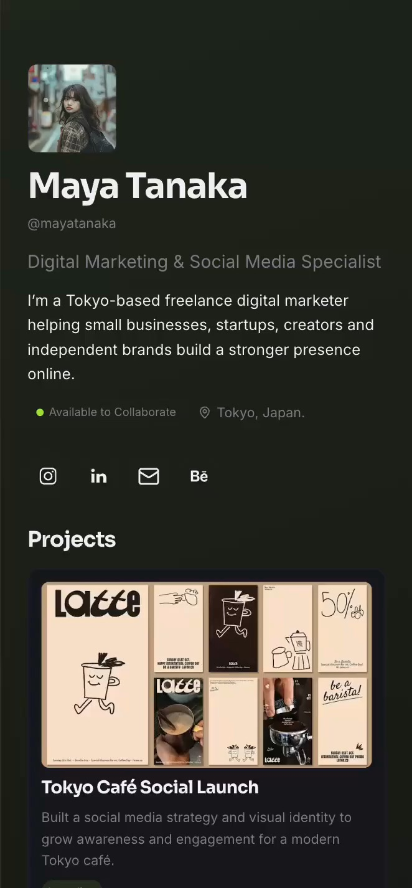
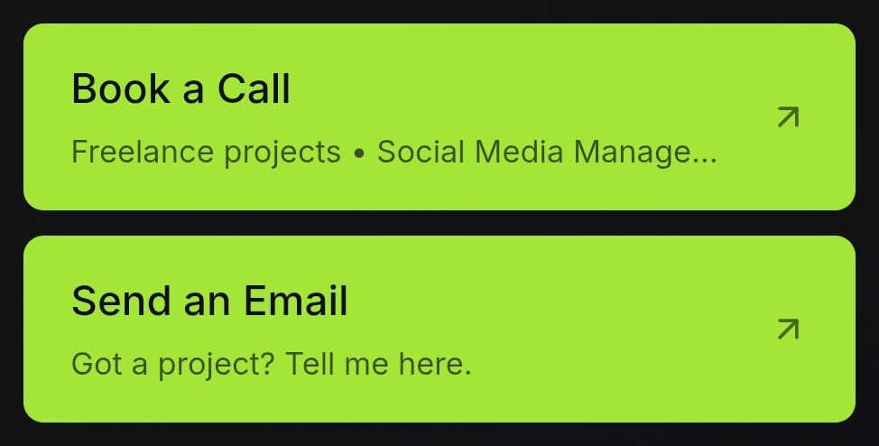
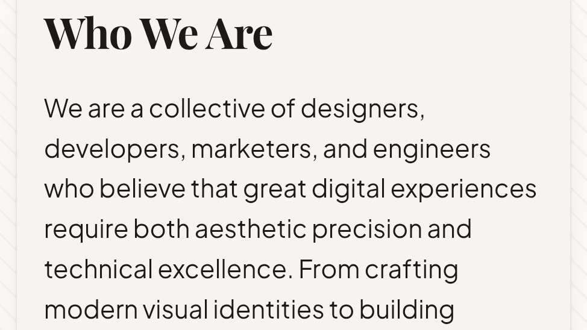
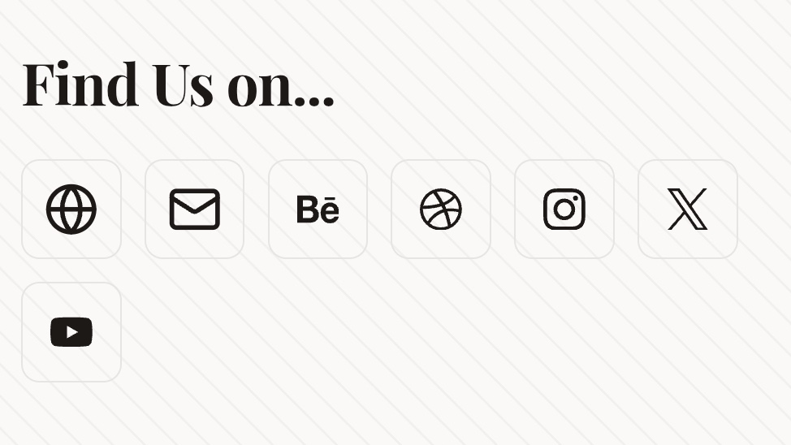

<p align="center">
  
</p>

<p align="center">
  A customizable digital profile platform. Every user gets <code>owna.online/{username}</code> —
  a page built from drag-and-drop blocks and a theme they control, with no code,
  no hosting and no deploys.
</p>

<p align="center">
  
</p>

One application, one renderer, many profiles. The username in the path selects
which configuration to render; publishing an edit takes effect through cache
invalidation, never a rebuild.

## Stack

Next.js 16 (App Router, Cache Components) · React 19 · TypeScript · Tailwind v4 ·
shadcn/ui · Supabase (Postgres, Auth, Storage) · Zod · dnd-kit · Vitest ·
Playwright. Deployed on Vercel.

## Getting started

```bash
bun install
cp .env.example .env.local     # fill in your Supabase URL and publishable key
```

Apply the schema to your Supabase project. The CLI login is interactive, so run
these yourself:

```bash
bunx supabase login
bunx supabase link --project-ref <your-project-ref>
bunx supabase db push
bunx supabase gen types typescript --linked > types/database.ts
```

In the Supabase dashboard, enable the Google provider under **Authentication →
Providers** and add `<your-origin>/auth/callback` as a redirect URL.

```bash
bun run dev
```

## Scripts

| Command | What it does |
| --- | --- |
| `bun run dev` | Development server |
| `bun run build` | Production build |
| `bun run typecheck` | `tsc --noEmit` |
| `bun run lint` | ESLint |
| `bun run test` | Unit tests (Vitest) |
| `bun run test:integration` | RLS tests against a real Supabase project |
| `bun run test:e2e` | Playwright, the full create → publish → visit loop |

The integration and e2e suites need a scratch Supabase project with email
confirmation disabled; both skip themselves when their env vars are absent. See
`.env.example`.

## Blocks

A profile is a sequence of blocks, each a pure data record (`lib/blocks/definitions.ts`)
rendered by one shared component on both the editor canvas and the public page.

<table>
  <tr>
    <td align="center" width="33%">
      <br>
      <sub><b>Hero</b> — avatar, name, bio, availability, socials</sub>
    </td>
    <td align="center" width="33%">
      <br>
      <sub><b>Projects</b> — case studies with an image gallery</sub>
    </td>
    <td align="center" width="33%">
      <br>
      <sub><b>Links</b> — call-to-action cards</sub>
    </td>
  </tr>
  <tr>
    <td align="center">
      <br>
      <sub><b>Gallery</b> — image grid</sub>
    </td>
    <td align="center">
      <br>
      <sub><b>Image</b> — single photo</sub>
    </td>
    <td align="center">
      <br>
      <sub><b>Text</b> — heading and copy</sub>
    </td>
  </tr>
  <tr>
    <td align="center">
      <br>
      <sub><b>Embed</b> — YouTube/Spotify/etc. by URL</sub>
    </td>
    <td align="center">
      <br>
      <sub><b>Social links</b> — a row of platform icons</sub>
    </td>
    <td></td>
  </tr>
</table>

## How it fits together

```
Supabase Postgres ──┬── draft:     profiles + pages + blocks   (RLS: owner only)
                    └── published: profile_publications        (RLS: world-readable)
                                          │  one indexed row, `use cache`
   Editor (client)                        ▼
   useReducer ──debounced──► Server Actions ──► app/[username]/page.tsx
        │                                              │
        └──────────────► <ProfileRenderer> ◄───────────┘
```

Four decisions carry most of the weight:

**Block definitions are pure data.** `lib/blocks/definitions.ts` holds each
block's type, Zod schema and defaults, with no React anywhere in it. Renderers
and inspectors live in two separate registries keyed off it, so editor-only code
— colour pickers, drag handles, property panels — never reaches a public page.
`tests/unit/architecture.test.ts` enforces this.

**Block renderers are pure presentational components.** No `async`, no fetching,
no `server-only`. The server renders them for the public page and the editor
renders the very same components in the browser for the live preview, so the
preview cannot drift from production.

**The public page reads exactly one row.** Publishing calls
`public.publish_profile()`, which assembles a JSONB snapshot from the owner's own
rows *inside the database* — profile, theme, layout, ordered visible blocks, SEO.
Rendering a profile is one indexed lookup, wrapped in `use cache` and tagged with
the username. Publishing invalidates that tag.

**Nothing trusts the client.** Every write goes through Row Level Security as the
signed-in user; there is no service-role key in the codebase. The publish
snapshot is built server-side rather than posted. Links are re-validated against
a protocol allowlist at render time as well as on write. Embeds are never user
HTML — a pasted URL is matched against a strict per-provider pattern and the
iframe `src` is built from a fixed template.

## Layout

```
app/[username]/          the public profile: page, 404, OG image
app/(auth)/              sign in, sign up, callbacks
app/onboarding/          claiming a username
app/(app)/               dashboard, editor, settings, preview + Server Actions
components/public/       the renderer and the nine block components
components/editor/       the editor: canvas, outline, inspectors, theme panel
lib/blocks/              block definitions, embed providers, snapshot schema
lib/themes/              theme schema, CSS variables, fonts, presets, contrast
lib/supabase/            three clients: browser, server (cookies), public (cached)
supabase/migrations/     schema, RLS, RPC functions, storage
```

## Notes

- `proxy.ts` replaces `middleware.ts` in Next.js 16. Its matcher deliberately
  covers only signed-in routes: public profiles must never touch cookies, or the
  responses stop being cacheable.
- `cacheComponents: true` is on. Request-time reads sit behind `<Suspense>`;
  `/[username]` sets `instant = false` because a page whose every pixel depends
  on an unbounded username has no static shell to prerender.
- Fonts are a fixed curated set. `next/font/google` needs literal build-time
  calls, so users choose from ten families rather than bringing their own.
- Themes are applied as inline CSS custom properties, not a generated
  stylesheet — no CSS injection surface, and it works under a strict CSP.

## Not built yet

Custom domains (the `domains` table exists and is empty), remix, a theme
marketplace, discovery/search, analytics beyond a dashboard placeholder, and
multi-page profiles (the `pages` table supports it; the UI does not expose it).
